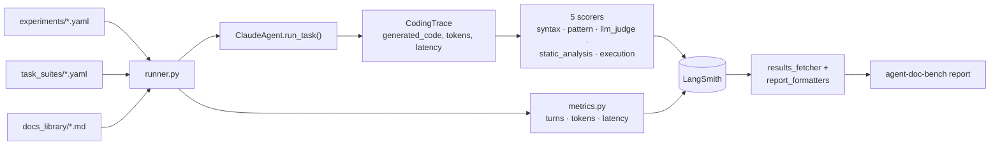
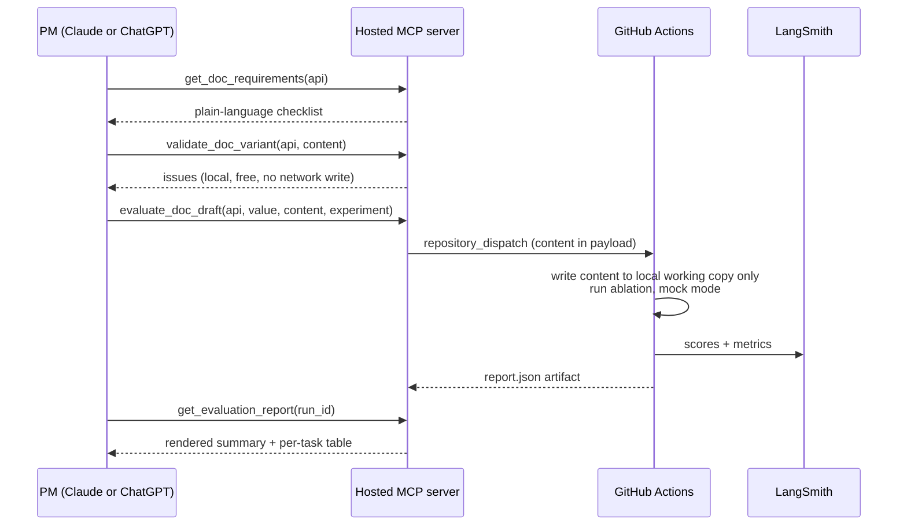

# Plan: agent-doc-bench

## Context

API product teams write documentation to guide developers on how to use their APIs. The question is: **does that documentation actually help AI coding agents produce correct code?** `agent-doc-bench` is a generic evaluation framework that tests this by having a coding agent complete programming tasks — with different documentation, models, or tooling — and scoring whether the generated code:

- Picks the right product / API surface
- Uses the correct authentication method
- Follows recommended design patterns
- Has valid syntax for the target language

The framework is designed for ablation studies: hold all factors constant, vary exactly one (model, doc version, tools available), and measure the impact. Initial use case is Bloomberg BLPAPI documentation, but the framework is API-agnostic.

**Confirmed choices:** LangSmith for experiment tracking, project name `agent-doc-bench`.

---

## Status at a glance

| Part | What it is | Status |
|---|---|---|
| [Part 1](#part-1--core-benchmark-shipped) | CLI-driven ablation framework: run tasks through an agent, score with 5 scorers, report from LangSmith | **Shipped**, in daily use |
| [Part 2](#part-2--pm-facing-doc-evaluation-via-claude-and-chatgpt-planned) | Let a PM evaluate a doc draft conversationally from Claude or ChatGPT, no repo access needed | **Design only** — not started |

### Next steps (Part 2, in order)

1. ~~Push repo to GitHub~~ ✅
2. ~~`agent_doc_bench/doc_source.py` — seam for reading named doc variants~~ ✅
3. ~~`agent_doc_bench/docs_validator.py` + `validate-docs` CLI command~~ ✅
4. ~~First pytest suite (`tests/test_docs_validator.py`)~~ ✅ — 5 tests, all passing; `uv run pytest tests/`
5. ~~`agent_doc_bench/doc_requirements.py` — plain-language checklist generator~~ ✅ — advisory reference, not a spec
6. `mcp_server/` scaffold **(up next)** — read-only tools (`list_apis`, `get_doc_requirements`, `list_doc_variants`, `get_doc_variant`, `validate_doc_variant`)
7. `.github/workflows/evaluate-doc-draft.yml` — runs an ablation on demand, commits nothing
8. `mcp_server/actions_client.py` + the evaluate/status/report tools
9. Decide hosting for the MCP server + wire OAuth
10. Register the hosted connector in Claude Desktop and ChatGPT; smoke test end to end

Full detail on each step is in [Part 2](#part-2--pm-facing-doc-evaluation-via-claude-and-chatgpt-planned).

---

## How it works

### Part 1 — today's pipeline



### Part 2 — planned PM evaluation flow



The draft never touches the repo — no commit, no branch, no PR. `docs_library/` stays engineer-only, edited the normal way (Claude Code + a real PR), unrelated to this flow.

---

## Part 1 — Core Benchmark (Shipped)

### Project Structure

```
agent-doc-bench/
├── pyproject.toml                  # Python 3.11+, uv (PEP 621 + hatchling)
├── .env.example                    # ANTHROPIC_API_KEY, LANGSMITH_API_KEY
│
├── agent_doc_bench/
│   ├── cli.py                      # Typer CLI: run / report
│   ├── config.py                   # ExperimentConfig dataclass + YAML loader
│   ├── runner.py                   # Orchestrates: config → agent → scorers → reporter
│   │
│   ├── agent/
│   │   ├── base_agent.py           # Abstract: run_task(task, docs) → CodingTrace
│   │   └── claude_agent.py         # Claude implementation (Anthropic SDK, streaming tool_use loop)
│   │
│   ├── tasks/
│   │   ├── base_task.py            # CodingTask dataclass
│   │   └── task_registry.py        # Load tasks from task_suites/ YAML files
│   │
│   ├── scorers/
│   │   ├── base.py                 # EvaluatorResult + run_scorer() — shared {key, score, comment} shape
│   │   ├── syntax_scorer.py        # ast.parse() — does the code parse?
│   │   ├── pattern_scorer.py       # Regex/AST checks for expected + anti-patterns
│   │   ├── llm_judge.py            # LLM-as-judge: product, auth, design pattern quality
│   │   ├── static_analysis_scorer.py  # ruff (pyflakes) + bandit (security) on generated code
│   │   └── execution_scorer.py     # Runs generated code against the blpapi mock in a subprocess
│   │
│   ├── sandbox/
│   │   ├── executor.py             # subprocess runner: executes Python, captures stdout/stderr/exit code
│   │   ├── live_runner.py          # Live-mode entrypoint: installs instrumentation, runs generated.py
│   │   └── fixtures/
│   │       ├── blpapi_mock.py      # Scoped mock of the `blpapi` module for execution_scorer (BLOOMBERG_MODE=mock)
│   │       └── blpapi_live_shim.py # Wraps real blpapi.Session to log event/timing metadata only (BLOOMBERG_MODE=live)
│   │
│   └── reporting/
│       ├── langsmith_reporter.py   # evaluate() wrapper, tags experiments
│       ├── metrics.py              # Tracked metrics (latency, tokens, turns) — always-on, not a grader
│       ├── results_fetcher.py      # Reads scores/comments/code back from LangSmith into plain dataclasses
│       └── report_formatters.py    # Renders results_fetcher output as a rich table, JSON, or Markdown
│
├── docs_library/                   # Documentation variants (Markdown)
│   └── blpapi/
│       ├── none.md                 # Empty — no-doc baseline
│       ├── v1.md                   # First version of BLPAPI agent guidance
│       └── v2.md                   # Iteration B for A/B comparison
│
├── task_suites/                    # Task definitions (YAML)
│   └── blpapi/
│       ├── auth_tasks.yaml         # How to authenticate / open a session
│       ├── data_tasks.yaml         # Fetch prices, history, bulk data
│       └── pattern_tasks.yaml      # Design patterns (sync vs async, error handling)
│
└── experiments/                    # Ablation configs (YAML)
    ├── doc_ablation.yaml           # Vary: docs | Fixed: model=sonnet, tools=none
    ├── llm_ablation.yaml           # Vary: model | Fixed: docs=v1, tools=none
    └── tools_ablation.yaml         # Vary: tools | Fixed: model=sonnet, docs=v1
```

### Core Concepts

**CodingTask**
```yaml
# task_suites/blpapi/auth_tasks.yaml
- id: blpapi_open_session
  instruction: "Write Python code to connect to a Bloomberg Terminal using BLPAPI and open a session."
  language: python
  expected_patterns:
    - regex: "blpapi\\.Session\\("
      label: "uses Session class"
    - regex: "session\\.start\\("
      label: "calls session.start()"
  anti_patterns:
    - regex: "(username|password|api[_-]?key)"
      label: "wrong auth method"
  llm_judge_rubric: |
    Score each dimension 1–5:
    - product_selection: Used BLPAPI (not Bloomberg REST API or Data License)?
    - auth_method: Used local terminal auth (not credentials)?
    - design_pattern: Followed synchronous session pattern correctly?
    - syntax_quality: Is the code idiomatic, complete, and correct Python?
```

**ExperimentConfig**
```yaml
# experiments/doc_ablation.yaml
name: doc_ablation
task_suite: blpapi
variable:
  name: documentation
  values: [none, v1, v2]          # maps to docs_library/blpapi/{value}.md
fixed:
  model: claude-sonnet-4-6
  tools: none
scorers: [syntax, pattern, llm_judge, static_analysis, execution]
langsmith_project: agent-doc-bench
```

Only one `variable` key per experiment — enforces single-variable isolation.

**CodingTrace** (output of agent)
```python
@dataclass
class CodingTrace:
    generated_code: str
    language: str
    steps: int                  # turns used
    token_usage: dict
    tool_calls: list[ToolCall]  # if agent used tools (web search, etc.)
    error: str | None
    latency: dict                # time_to_first_token, time_to_last_token, output_tokens_per_sec
```

### Scorer Pipeline

Every scorer returns an object exposing `.score` and `.comment`; `runner.py` wraps each call in
`scorers/base.py`'s `run_scorer()` so one scorer raising can't abort the whole evaluation run, and
reports uniformly as LangSmith feedback `{key, score, comment}`.

| Scorer | Input | Output | Notes |
|---|---|---|---|
| `SyntaxScorer` | `generated_code` | pass/fail + error msg | `ast.parse()` for Python; language-specific |
| `PatternScorer` | `generated_code` + task patterns | score 0–1 per pattern group | Counts matched expected / anti-pattern hits |
| `LLMJudgeScorer` | `generated_code` + task rubric | structured grades (Pydantic) | Uses `claude-haiku-4-5` as judge for speed |
| `StaticAnalysisScorer` | `generated_code` | score 0–1 + issue list | `ruff` (pyflakes only) + `bandit` (security); no type-checker since BLPAPI has no stubs |
| `ExecutionScorer` | `generated_code` + `sandbox/fixtures/blpapi_mock.py` (or real `blpapi`, live mode) | pass/fail + comment | Runs the script in a subprocess. Catches behavioral bugs (e.g. an event loop that never breaks) that regex can't. See "Execution modes" below for mock vs. live |

Toggled per-experiment via `scorers: [...]` in the experiment config — a task suite for a different
API would swap in its own mock/executor rather than reusing `blpapi_mock.py`.

**Execution modes: mock vs. live.** `ExecutionScorer` branches on the `BLOOMBERG_MODE` env var (`.env.example`):

- **`mock` (default).** `sandbox/fixtures/blpapi_mock.py` is written into the sandbox as `blpapi.py`,
  shadowing the real package, and the generated script runs against it directly. Coverage is limited
  to the request/response shapes the current task suite exercises — calls outside that raise a
  distinctly `"blpapi_mock:"`-prefixed error so a mock gap is distinguishable from a real defect. This
  is the CI/default path and needs no Bloomberg Terminal.
- **`live`.** Runs against a real Bloomberg Terminal via the real `blpapi` SDK (installed via the
  `live` extra, see Setup). Because the script's own stdout/stderr may contain real market data (e.g.
  a printed price), the scorer never reads them into `.comment` — nothing derived from a live run
  reaches LangSmith except the exit code and *structural* session metadata (event types, message
  counts, elapsed time). This is captured by `sandbox/fixtures/blpapi_live_shim.py`, which monkeypatches
  `blpapi.Session.start/stop/sendRequest/nextEvent` to log shape/timing only — never field values — to
  a JSON file the scorer reads. `sandbox/live_runner.py` is the actual subprocess entrypoint in live
  mode: it installs the shim, then runs `generated.py` via `runpy`, flushing metadata even on failure.
  Raw stdout/stderr are written only to a local, gitignored log file
  (`sandbox/.live_logs/<task_id>__<variable_name>-<variable_value>__<timestamp>.log`, with a header
  spelling out the task/variant/fixed config) referenced by *path only* in the comment, for local
  debugging — never their contents.

### Tracked Metrics

Separate from correctness scorers — these measure cost/speed, not correctness, and are always
reported regardless of which scorers are enabled (`reporting/metrics.py`, invoked unconditionally
in `runner.py`). Reported as LangSmith feedback so they're sortable/comparable across doc/model/tool
variants in the same way correctness scores are:

- `metric_n_turns`, `metric_n_toolcalls`, `metric_n_total_tokens` — transcript size
- `metric_time_to_first_token`, `metric_time_to_last_token`, `metric_output_tokens_per_sec` — latency, captured via the streaming Messages API

### Agent Layer

`ClaudeAgent.run_task(task: CodingTask, doc_context: str, tools: list) → CodingTrace`

- Injects `doc_context` into system prompt inside a `<documentation>` block
- Runs an Anthropic SDK **streaming** tool_use loop (`client.messages.stream(...)`) until the agent emits a code block and stops, timing the first streamed chunk to compute `time_to_first_token`
- If `tools` includes `web_search`, wires in a web search tool via MCP or function call
- `doc_context` is loaded from `docs_library/{api}/{doc_version}.md`; empty string for `none`

### LangSmith Integration

1. Create/update a LangSmith dataset with all task inputs + expected criteria
2. `target_fn(inputs)`: calls `agent.run_task()` with the experiment's fixed + variable config
3. One evaluator function per enabled scorer, plus one always-on metrics evaluator — each returns `{key, score, comment}` (or a list of these) per LangSmith's evaluator interface
4. `evaluate(target_fn, data=dataset, evaluators=[...], client=client, experiment_prefix=run_id)` — `evaluate` is a top-level `langsmith` function, not a `Client` method
5. Each run tagged with `variable=value` so LangSmith comparison view works automatically

### CLI Commands

```bash
# Run an ablation (records results in LangSmith)
agent-doc-bench run experiments/doc_ablation.yaml

# Print a scored summary + per-task detail table, pulled from LangSmith
agent-doc-bench report experiments/doc_ablation.yaml

# Machine-readable export (e.g. to paste into an LLM chat for interpretation)
agent-doc-bench report experiments/doc_ablation.yaml --format markdown
agent-doc-bench report experiments/doc_ablation.yaml --format json --output report.json

# (Future) Record live Bloomberg responses to fixtures for mock mode
agent-doc-bench record --task blpapi_open_session
```

### Implementation history

1. Scaffold `pyproject.toml` + package skeleton + `.env.example`  ✅
2. `config.py` — `ExperimentConfig` dataclass + YAML loader  ✅
3. `base_task.py` + `task_registry.py` — load tasks from YAML  ✅
4. `base_agent.py` + `claude_agent.py` — Anthropic SDK coding agent (streaming, with latency capture)  ✅
5. `syntax_scorer.py` — `ast.parse()` for Python; pluggable for other languages  ✅
6. `pattern_scorer.py` — regex + anti-pattern checking  ✅
7. `llm_judge.py` — LLM-as-judge with Pydantic structured grades  ✅
8. `langsmith_reporter.py` — `evaluate()` wrapper  ✅
9. `runner.py` — ties config → agent → scorers → reporter  ✅
10. `cli.py` — Typer `run` and `report` commands  ✅
11. Seed `task_suites/blpapi/auth_tasks.yaml`, `data_tasks.yaml`, `pattern_tasks.yaml` with 5 tasks total  ✅
12. Seed `docs_library/blpapi/none.md` and `docs_library/blpapi/v1.md`  ✅ (`v2.md` still a stub — needs real content before `doc_ablation` says anything about v1 vs v2)
13. Seed `experiments/doc_ablation.yaml`, `llm_ablation.yaml`, `tools_ablation.yaml`  ✅
14. `scorers/base.py` — shared `{key, score, comment}` evaluator result + `run_scorer()` failure isolation  ✅
15. `static_analysis_scorer.py` — ruff + bandit  ✅
16. `sandbox/fixtures/blpapi_mock.py` + `execution_scorer.py` — scoped BLPAPI mock and execution grader  ✅
17. `reporting/metrics.py` — tracked metrics (turns, tokens, latency), always-on  ✅
18. `tools_ablation.yaml` is seeded but untested end-to-end — no scorer currently grades `CodingTrace.tool_calls`, so a tools ablation run wouldn't yet tell you whether the agent actually used the tool it was given
19. Migrated `pyproject.toml` from Poetry to `uv` (PEP 621 + `hatchling`); `blpapi` sourced from
    Bloomberg's own package index via a uv dependency group (`[dependency-groups] live = ["blpapi"]`,
    marked default via `[tool.uv] default-groups`), since it isn't on PyPI — a plain `uv sync` installs
    it; opt out with `--no-default-groups` on a machine that can't reach Bloomberg's index  ✅
20. `sandbox/fixtures/blpapi_live_shim.py` + `sandbox/live_runner.py` — live-mode execution against a
    real Bloomberg Terminal, with metadata-only capture so no market data reaches LangSmith  ✅
21. `reporting/results_fetcher.py` + `reporting/report_formatters.py` — `report` now reads scores back
    from LangSmith (summary + per-task detail table, JSON/Markdown export) instead of only listing
    experiment names  ✅

### Verification

```bash
cd agent-doc-bench
uv sync                        # installs everything, including real blpapi (default group)
cp .env.example .env  # add ANTHROPIC_API_KEY + LANGSMITH_API_KEY

# Smoke test: single task, no docs, mock mode
uv run agent-doc-bench run experiments/doc_ablation.yaml

# Expected: LangSmith experiment appears with 3 rows (none/v1/v2)
# Each row shows syntax_score, pattern_score, llm_judge_score,
# static_analysis_score, execution_score, plus tracked metrics
# (metric_n_turns, metric_n_total_tokens, metric_time_to_first_token, ...)
# v1/v2 rows should outscore none on pattern + llm_judge (once v2.md has
# real content — see step 12 above)

# Verify locally without opening LangSmith's UI:
uv run agent-doc-bench report experiments/doc_ablation.yaml
```

---

## Part 2 — PM-Facing Doc Evaluation via Claude and ChatGPT (Planned)

**Status: design only, not yet implemented.** Recorded here so the approach is captured before building it.

### Context

Today only an engineer with Claude Code/shell access can realistically evaluate a documentation draft, because:

1. **Nothing tells a non-engineer what a doc needs to contain.** The real requirements live in `task_suites/<api>/*.yaml` (`expected_patterns`, `anti_patterns`, `llm_judge_rubric`) — technical YAML, not something a PM can read.
2. **There's no way for a PM to get a draft scored.** A PM would work from a separate machine, with no local checkout, and — per the confirmed goal — from *either* Claude or ChatGPT, not just one.
3. **A silent footgun exists today**: `_load_doc()` in `agent_doc_bench/runner.py:33-37` returns `""` (not an error) when a doc filename doesn't exactly match an experiment's `variable.values` entry. A wrong filename would silently run a "no docs" condition with no warning.

The goal: let a PM paste or attach a documentation draft in Claude or ChatGPT, get plain-language guidance on what "good" means for each API's benchmark tasks, and get it scored — without touching git, YAML, or the engineering machine.

### Key decisions

- **No repo-write path for PMs.** An earlier version of this design had a `propose_doc_variant` tool that opened a PR to permanently add a new named variant to `docs_library/`. Dropped: the actual ask is "let a PM evaluate a draft," not "let a PM commit to the benchmark corpus." At dozens-of-PMs scale, routing every draft through a PR would flood the repo with review overhead nobody wants, and it isn't necessary — a draft can be scored without ever being written to disk. `docs_library/` remains exactly as it is today: engineer-authored and reviewed the normal way (edit via Claude Code, open a PR), unrelated to this feature. If a draft is ever good enough to become a permanent named variant, that's still that same ordinary engineering step.
- **Hosted MCP server (HTTP/SSE), not a local `.mcpb`.** `.mcpb` packaging only satisfies Claude Desktop; ChatGPT's connector model (Team/Enterprise/Pro "connectors") expects a remote HTTP/SSE MCP endpoint reachable at a URL. One hosted server, registered as a connector in both clients, covers both without duplicating tool logic.
- **PMs authenticate to the connector, not to GitHub.** OAuth at the connector layer (Claude/ChatGPT account-level); the server itself holds one shared service credential scoped to `Contents: read` + `Actions: write`. It never has write access to repo contents, so there's no per-PM PAT, no per-PM GitHub identity to provision.
- **Evaluation runs via GitHub Actions (`repository_dispatch`), never inside the MCP server process.** An ablation run is minutes-long (streaming agent loop × N tasks × LLM judge) — too long for a synchronous MCP tool call. The server only dispatches and polls. The draft's content is never committed — it's passed through the dispatch payload and written only to the ephemeral runner's local working copy.
- **`docs_library/` is one interchangeable backend, not a permanent fact.** Reads for named variants (`v1`, `v2`, `none`, ...) go through a single seam (`doc_source.py`) instead of hardcoded filesystem/GitHub-Contents calls at each site — if canonical docs move to a different host later (a CMS, a docs database), only that one file changes. PM drafts are unaffected either way since `evaluate_doc_draft`'s content is already passed through inline, never touching `docs_library/`.
- Repo needs to be pushed to GitHub first (not yet done).
- Includes the repo's first-ever pytest suite.

### Layer 1 — Repo-side validator + CLI guardrail

New file `agent_doc_bench/docs_validator.py` — pure function, no CLI/MCP framework leakage, mirroring the shape of `agent_doc_bench/config.py`'s `ExperimentConfig.from_yaml()`:

```python
@dataclass
class DocIssue:
    experiment: str
    api: str        # task_suite, doubles as docs_library subfolder
    value: str       # the variable.values entry, e.g. "v1"
    kind: str        # "missing" | "empty_non_none" | "stub"
    path: Path
    detail: str

def validate_docs(experiments_dir=Path("experiments"), docs_base=Path("docs_library"),
                   stub_threshold_chars=200) -> list[DocIssue]:
    ...
```

For every `experiments/*.yaml` whose `variable.name == "documentation"`, for each `value` in `variable.values`, check `docs_base/<task_suite>/<value>.md`:
- **missing** — file doesn't exist (the exact `_load_doc()` footgun, turned into a hard failure).
- **empty_non_none** — file is empty/whitespace and `value != "none"` (empty `none.md` is required and correct — never flag it).
- **stub** — file is non-empty but trivially short / contains a `> **Stub.**` marker (heuristic; treat as a warning, not a hard failure — today's `docs_library/blpapi/v1.md` trips this, since it says outright "replace this file with your actual documentation"; `v2.md` isn't referenced by any experiment's `variable.values` yet, so it isn't checked at all).

Never raises on one bad file — collects all issues, mirroring the failure-isolation pattern in `agent_doc_bench/scorers/base.py`'s `run_scorer()`. This same function is reused, unmodified, by `validate_doc_variant` below to check a PM's draft in a temp dir before it's ever evaluated.

CLI wiring in `agent_doc_bench/cli.py`: new `@app.command(name="validate-docs")`, following the existing thin-command style (`run`/`report`: parse args, defer heavy imports into the function body, print via the shared `rich.Console`). Non-strict: warns on `stub`, exits 1 only on `missing`/`empty_non_none`. `--strict` flag also fails on `stub`.

New file `agent_doc_bench/doc_source.py` — the one seam that knows where named doc variants actually live:

```python
def list_variants(api: str, base_dir=Path("docs_library")) -> list[str]: ...
def get_variant(api: str, value: str, base_dir=Path("docs_library")) -> str: ...
```

Git/filesystem-backed today (a thin wrapper over reading `docs_library/<api>/*.md` — no behavior change from what `_load_doc()` already does), but every other reader — `validate_docs()`'s `docs_base` traversal, `runner.py`'s `_load_doc()`, and the MCP server's `list_doc_variants`/`get_doc_variant` tools — should call through this module rather than opening `docs_library/` paths directly.

### Layer 2 — MCP server (read-only GitHub access + Actions-triggered evaluation)

New top-level directory `mcp_server/` (sibling to `agent_doc_bench/`, not nested in it — different dependency footprint (`mcp`, `PyGithub`) and deployment target (a hosted service) than the core benchmark library). Depends on `agent_doc_bench` as a library (imports `docs_validator.validate_docs`, `doc_requirements.build_doc_requirements`, `tasks.task_registry.load_suite`, `reporting.report_formatters`) — never the reverse.

Add an optional dependency group so a plain `uv sync` for benchmark work doesn't pull these in:
```toml
[dependency-groups]
mcp_server = ["mcp>=1.0", "PyGithub>=2.4"]
```

New file `agent_doc_bench/doc_requirements.py` — `build_doc_requirements(api, base_dir=Path("task_suites")) -> str`. Generates a plain-language Markdown checklist **on the fly** from `task_registry.load_suite(api)` — no new YAML schema field. Rationale: `expected_patterns[].label` / `anti_patterns[].label` are already human-readable (e.g. `"instantiates blpapi.Session"`), and `llm_judge_rubric` is already prose — passing them through avoids a second source of truth that would drift from the real pattern/rubric definitions, and avoids touching `task_suites/*.yaml`'s existing 4-field convention (`AGENTS.md`: "Tasks are data, not code").

Tools exposed by `mcp_server/server.py` (using the official `mcp` Python SDK's `FastMCP`, HTTP/SSE transport):

| Tool | Purpose |
|---|---|
| `list_apis()` | List `docs_library/` subfolders via GitHub Contents API (read-only) |
| `list_experiments()` | List `experiments/*.yaml`, their swept variable + values |
| `get_doc_requirements(api)` | Plain-language checklist — fetches `task_suites/<api>/*.yaml` into a temp dir, calls `doc_requirements.build_doc_requirements` against it |
| `list_doc_variants(api)` | Existing named variants, for context ("here's what v1/v2 already look like") — calls `doc_source.list_variants`, not a hardcoded path |
| `get_doc_variant(api, value)` | Raw content of an existing variant — `doc_source.get_variant`, same seam |
| `validate_doc_variant(api, content)` | Runs `docs_validator.validate_docs` against the PM's draft in a temp dir — pure local check, no network write, lets the PM self-correct before spending an evaluation run |
| `evaluate_doc_draft(api, value, content, experiment)` | Dispatches an ablation run with this draft substituted in for `value`; returns a run id — see flow below |
| `get_evaluation_status(run_id)` | Polls GitHub Actions run status (`queued`/`in_progress`/`completed`) |
| `get_evaluation_report(run_id)` | Once completed, downloads the JSON report artifact and renders it via `reporting/report_formatters.py` — the same formatter the CLI's `--format markdown` path uses, so the PM sees the identical summary + per-task table an engineer would see locally |

`content` is a plain string on every tool that takes one — a PM pastes Markdown directly, or attaches a file and the client (Claude/ChatGPT) extracts its text before calling the tool; MCP itself has no separate "file" argument type. No draft IDs, no server-side storage — nothing persists between calls, so there's nothing to clean up.

`evaluate_doc_draft` flow (`mcp_server/github_client.py` wraps PyGithub for read-only Contents access; `mcp_server/actions_client.py` wraps the Actions API for dispatch/poll/artifact):
1. Fetch `experiments/<experiment>.yaml` (read-only) to confirm it exists and uses `variable.name == "documentation"`.
2. Fire a `repository_dispatch` event (`event_type: evaluate-doc-draft`) with `client_payload: {api, value, content, experiment}` (Markdown docs are a few KB — well within GitHub's ~64KB `client_payload` limit).
3. `.github/workflows/evaluate-doc-draft.yml` (triggered by that event) checks out `main`, writes `content` into `docs_library/<api>/<value>.md` **in the runner's local working copy only**, patches `experiments/<experiment>.yaml`'s `variable.values` in that same local copy if `value` isn't already listed, then runs `docs_validator.validate_docs(strict=True)` as a hard gate before spending any Anthropic/LangSmith budget.
4. Runs `agent-doc-bench run experiments/<experiment>.yaml` (mock mode only — no Bloomberg Terminal reachable from a hosted runner), then `agent-doc-bench report --format json`, uploads the JSON as a workflow artifact.
5. Nothing is committed or pushed at any point — the repo's `git status` at the end of the job is identical to its start.

Because `repository_dispatch` doesn't return a run id directly, the server polls `GET /repos/{owner}/{repo}/actions/workflows/evaluate-doc-draft.yml/runs` for the newest run right after dispatching and returns its `run_id`.

`MCP_DRY_RUN=1` env var: skips the dispatch, returns a synthetic "would run experiment X with draft Y" response — the mechanism for testing tool logic without burning a real evaluation run.

Service credential scope (documented in `mcp_server/README.md`): one fine-grained PAT (or GitHub App installation token) scoped to this one repo — `Contents: Read`, `Actions: Read and write`. No `Contents: Write`, no `Pull requests` scope at all — the server is structurally incapable of writing to the repo.

### Layer 3 — Hosting + dual-client registration (Claude Desktop + ChatGPT)

- Serve over HTTP/SSE (`FastMCP` supports this transport directly) from one deployed instance reachable at a stable URL. Host TBD (needs a decision — anything that can run a small always-on Python process behind HTTPS).
- Front it with OAuth so PMs authenticate with their own Claude/ChatGPT-linked identity; the server's own GitHub credential (above) is a single shared service identity, never something a PM sees or provides.
- **Claude Desktop**: add as a remote MCP connector pointing at the hosted URL (Settings → Connectors).
- **ChatGPT**: add as a custom connector (Team/Enterprise/Pro tier) pointing at the same hosted URL.
- Same tool logic, same evaluation flow, in both — no second implementation, no drift risk between what each client can do.

PM usage (documented in `mcp_server/README.md`):
1. An engineer confirms the hosted URL is live and the OAuth app is registered.
2. PM adds the connector once per client (Claude Desktop or ChatGPT → Settings → Connectors) using the hosted URL, and completes the OAuth prompt — no PAT, no manifest file, no local Python.
3. Chat naturally in either client: "what does the blpapi docs need to cover?" → `get_doc_requirements`; paste or attach a draft and ask "score this" → `validate_doc_variant` then `evaluate_doc_draft` + `get_evaluation_report`.

**Note on file attachments**: for Markdown/plain-text drafts this is a lossless pass-through — the client sends exactly what was pasted or attached. For non-text formats (PDF, Word), both clients will extract text, but that extraction is a summarize/reformat step, not a guaranteed verbatim transcription — risky for a format whose exact strings get regex-matched (`expected_patterns`/`anti_patterns`). PMs should author/paste in Markdown directly rather than upload PDFs/Word docs; see Open risks.

### New/modified files (planned)

```
agent_doc_bench/
├── docs_validator.py          NEW
├── doc_requirements.py        NEW
├── doc_source.py              NEW — seam for reading named variants; docs_validator, runner.py, and mcp_server read through it
└── cli.py                     MODIFIED — add `validate-docs` command

.github/workflows/
└── evaluate-doc-draft.yml     NEW — repository_dispatch entrypoint for evaluate_doc_draft; never commits

mcp_server/                    NEW top-level dir
├── server.py                  FastMCP tool definitions (HTTP/SSE transport)
├── github_client.py           PyGithub wrapper, read-only (Contents)
├── actions_client.py          GitHub Actions API wrapper (dispatch, run status, artifact download)
├── README.md                  Hosting/OAuth setup + service credential scope + dry-run testing
└── tests/
    ├── test_server_dry_run.py
    └── test_actions_client.py

tests/
└── test_docs_validator.py     NEW — first test file in the repo

pyproject.toml                 MODIFIED — optional `mcp_server` dependency group (mcp, PyGithub); pytest as dev dep
AGENTS.md                      MODIFIED — add "Doc evaluation via MCP connector" pointer + validate-docs in Common commands
README.md                      MODIFIED — mention validate-docs, link mcp_server/README.md
```

### Implementation steps (detail)

1. Push repo to GitHub (prerequisite for Layers 2/3 — confirm timing separately)  ✅
2. `agent_doc_bench/doc_source.py` — `list_variants()`/`get_variant()`, git-backed; `runner.py`'s `_load_doc()` and `docs_validator.py` route through it instead of touching `docs_library/` paths directly  ✅
3. `agent_doc_bench/docs_validator.py` — `validate_docs()` + `DocIssue`  ✅
4. `cli.py` — `validate-docs` command  ✅
5. `tests/test_docs_validator.py` — pytest added as dev dependency; covers stub flag (`v1.md`'s own `**Stub.**` marker), `none.md` exemption, filename-mismatch footgun  ✅ (`v2.md` isn't currently referenced by any experiment's `variable.values`, so it's out of scope for the validator today — see note below)
6. `agent_doc_bench/doc_requirements.py` — `build_doc_requirements()`, tested against real `task_suites/blpapi/*.yaml` labels  ✅ (explicitly framed as advisory reference, not a spec — a writer is free to phrase docs however reads best; only the resulting generated code is ever scored, never doc wording)
7. `mcp_server/` scaffold — `server.py` (HTTP/SSE), `github_client.py` (read-only, calls through `doc_source.py`), optional uv dependency group
8. `.github/workflows/evaluate-doc-draft.yml` — `repository_dispatch` handler: local-only file write, validate gate, mock-mode run, JSON report artifact, no commit/push
9. `mcp_server/actions_client.py` + `evaluate_doc_draft`/`get_evaluation_status`/`get_evaluation_report` tools
10. `mcp_server/tests/test_server_dry_run.py` + `test_actions_client.py` — all 9 tools exercised without real GitHub/Actions calls
11. Decide + stand up hosting for the HTTP/SSE server; wire OAuth in front of it; provision the read-only + Actions-write service credential
12. Register the hosted URL as a connector in Claude Desktop and in ChatGPT; confirm both round-trip `get_doc_requirements` → `validate_doc_variant` → `evaluate_doc_draft` → `get_evaluation_report`
13. One manual smoke test of the real evaluate path against a throwaway/test repo

### Verification (once implemented)

1. `tests/test_docs_validator.py`: `validate_docs()` against the real `experiments/`/`docs_library/` flags `docs_library/blpapi/v2.md` as `kind="stub"`; `none.md` is not flagged despite being empty; a deliberately mismatched filename is flagged `kind="missing"`.
2. `doc_requirements.build_doc_requirements("blpapi")` test asserts output contains known pattern labels (e.g. `"instantiates blpapi.Session"`).
3. `mcp_server/tests/test_server_dry_run.py`: drive the server via the `mcp` SDK's client session (HTTP/SSE), with `MCP_DRY_RUN=1` and `github_client`/`actions_client` mocked/pointed at local disk for read tools.
4. `mcp_server/tests/test_actions_client.py`: `evaluate_doc_draft` dispatches with the right `client_payload` (mocked GitHub API); `get_evaluation_report` correctly renders a fixture `report.json` through `report_formatters.py`.
5. `uv run agent-doc-bench validate-docs` against the repo as-is prints the `v2.md` stub warning, exits 0; `--strict` exits 1.
6. One manual smoke test of the real evaluate path (`MCP_DRY_RUN=0`) against a throwaway/test repo — confirm a real Actions run completes, `git status` on `main` is unchanged before/after, `get_evaluation_report` returns a sane table, and the service credential can't write repo contents even if asked to.
7. Confirm the same `evaluate_doc_draft` → `get_evaluation_report` round trip works identically from both a Claude Desktop connector session and a ChatGPT connector session.

### Open risks

- **GitHub push is a prerequisite outside this design** — nothing in Layer 2/3 works until the repo has a remote.
- **Hosting + OAuth is a real lift** — an always-on service and a registered OAuth app. Worth confirming ChatGPT access is actually needed before starting this vs. a cheaper Claude-only local `.mcpb` fallback (still viable if it turns out only Claude Desktop is needed — reintroduces stdio transport and a per-PM env var for the read-only service credential instead of OAuth, nothing else changes).
- **Evaluation cost/latency per call**: each `evaluate_doc_draft` call burns real Anthropic + LangSmith usage and takes minutes; `validate_doc_variant` is free/local and should be presented to PMs as the first, cheap step before spending an evaluation run.
- **File-attachment fidelity**: pasted/attached Markdown passes through verbatim, but PDF/Word attachments go through a client-side text-extraction step that isn't guaranteed to preserve exact strings — a real risk for a format whose `expected_patterns`/`anti_patterns` are regex-matched. Mitigate by instructing PMs (in `mcp_server/README.md` and in tool descriptions) to paste or attach Markdown/plain text, not PDF/Word.
- **`repository_dispatch` payload size**: fine for a documentation file's usual few KB; if a draft ever approaches GitHub's ~64KB `client_payload` limit, `evaluate_doc_draft` should fail with a clear size error rather than silently truncating.
- **Stub-detection is a heuristic** (character count + marker match) — expect some false positives/negatives; keep it a warning, not a hard failure, outside `--strict`.
- **`llm_judge_rubric` passthrough** assumes existing rubric prose is PM-readable — confirmed for `auth_tasks.yaml`; worth a quick read-through of `data_tasks.yaml`/`pattern_tasks.yaml` rubrics before shipping to confirm they're equally plain-language.
- **CI evaluation is mock-mode only** — a PM's `evaluate_doc_draft` run never reflects live-Bloomberg-Terminal behavior; `get_evaluation_report` output should say so explicitly so a PM doesn't over-read a mock-mode score.
- **`docs_library/` may not be the long-term home for named variants** — if canonical docs move to a different host later, `doc_source.py` is the only file that should need to change; if a future implementation ends up bypassing it (a direct `Path("docs_library")` or GitHub Contents call added elsewhere for convenience), that migration gets harder again. Worth a quick grep for stray direct accesses before that migration, not just trusting the seam held.
